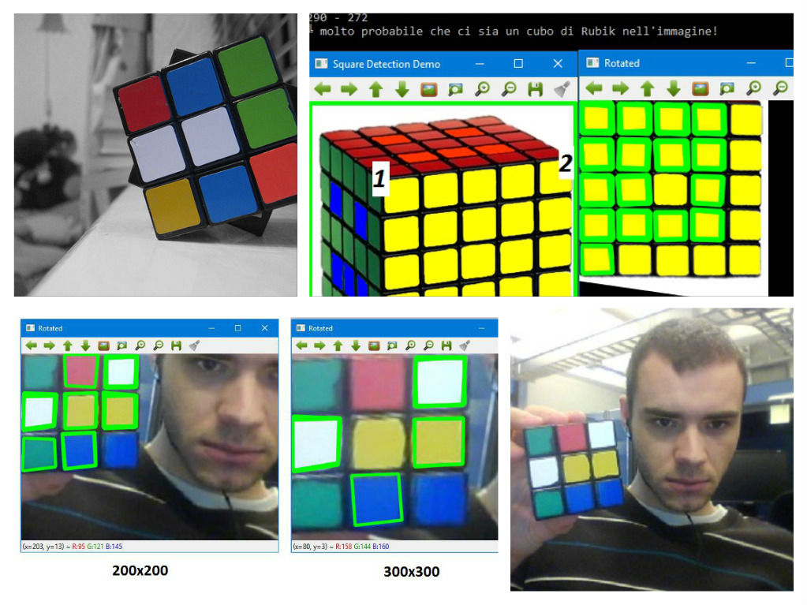

# Rubik's Cube Detector
A simple program detecting Rubik's Cubes inside images

|License|Issues|
|---------|---------|
|  | |

## Abstract
I was able to follow a course of Image Data Mining held by Professor Piergiorgio Lanza during my Master 
Degree of Computer Science at the University of the Eastern Piedmont in Alessandria, Italy.

This is the exam project made by me and BA Fabio Vannacci, consisting in a little program written in C++ 
able to recognize Rubik's Cubes inside a small dataset of images.

A technical review is available [here](docs/TechnicalNotes.pdf) (PDF Format)

## Setup
This project is made with [Code::Blocks](http://www.codeblocks.org/), [OpenCV](https://opencv.org/) library and [Qt](https://www.qt.io/)
framework using a Microsoft(R) Windows environment.

Due to the huge size of the OpenCV library required in order to compile and run the program, I've uploaded all
the required tools on a different platform (MEGA). 

You can download the whole archive (Code::Blocks, OpenCV and Qt5) alongside a configuration guide 
[clicking here](https://mega.nz/#!MBM2jDLI!bQlDFwBV1tw44f0DQE9TpLObNn6fJaroYd1UzNy_buE) (3.3GB)

## Acknowledgments
Thanks to [Andrej Karpathy](https://cs.stanford.edu/people/karpathy/) for his report [Extracting sticker colors on Rubik’s Cube, CPSC525 Project Report](http://www.cs.ubc.ca/andrejk/525project/) (Link offline, a copy of his report is inside "docs" folder in order to preserve it, all rights reserved to the creator)
